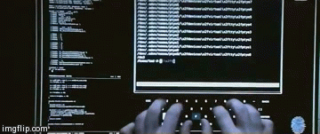

#ATORES

##SOBRE O PALCO


```scala
val autor = "Ricardo Franco"
val email = "rmf.franco@gmail.com"
val twitter = "@rmfranco"
val github = "rfranco"
val apresentacao = "rfranco.github.io/tdc2014-akka"
```


##@EU


##@VOC&Ecirc;
 <!-- .element: style="zoom:0.75" -->


## Modelo de Atores
 <!-- .element: style="zoom:1.3" -->


## Mailbox do Ator
 <!-- .element: style="zoom:1.0" -->


 <!-- .element: style="zoom:0.9" -->


## Como Criar o Ator
 <!-- .element: style="zoom:1.6" -->


## #LiveCoding
 <!-- .element: style="zoom:1.0" -->


## Como Conversar com o Ator 
 <!-- .element: style="zoom:1.6" -->


## #LiveCoding
 <!-- .element: style="zoom:1.0" -->


## Como Cuidar do Ator
 <!-- .element: style="zoom:1.6" -->


## #LiveCoding
 <!-- .element: style="zoom:1.3" -->


## Como Trabalha Em Equipe
 <!-- .element: style="zoom:1.6" -->


## #LiveCoding
 <!-- .element: style="zoom:1.0" -->


## Hierarquia dos Atores
 <!-- .element: style="zoom:1.0" -->


## Como Multiplicar o Ator
 <!-- .element: style="zoom:1.6" -->


## #LiveCoding
 <!-- .element: style="zoom:1.4" -->


## Como Supervisionar o Ator
 <!-- .element: style="zoom:1.6" -->


## #LiveCoding
 <!-- .element: style="zoom:1.0" -->


## + AKKA
| &nbsp;          | &nbsp;      |
|:---------------:|:-----------:|
| Typed Actors    |     TestKit |
| Mailbox         |          IO |
| Dispatcher      |      Remote |
| EventBus        |     Cluster |
| Scheduler       | Persistence |
| Circuit Breaker |      Stream |
| FSM             |        HTTP |


## D&uacute;vidas & Perguntas
 <!-- .element: style="zoom:1.3" -->


## Obrigado!