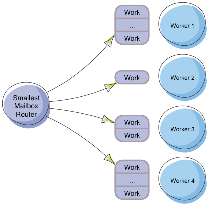

#ATORES

##SOBRE O PALCO
[Ricardo Franco]() - [@rmfranco]()


```scala
val autor = "Ricardo Franco"
val email = "rmf.franco@gmail.com"
val twitter = "@rmfranco"
val github = "rfranco"
val apresentacao = "rfranco.github.io/tdc2014-akka"
```


##@EU

#### jobs@paguemob.com <!-- .element: class="fragment" -->

Note:
- Scala 2 anos +
- Scala ecosistem


##@VOC&Ecirc;
 <!-- .element: style="zoom:0.75" -->

Note:
HelloWorld Scala e Akka


## Modelo de Atores
 <!-- .element: style="zoom:1.3" -->

Note:
- Modelo de concorrencia baseada no mundo real
- Comunicaçao por mesagems assincronas
- Concorrencia sem compartilhar os estados mutaveis
- Criado por Carl Hewitt em 1973 no MIT
- Primeira grande adoçao Ericsson no meio dos anos 80
- Popularizada por Erlang e open-sourced in 90s


## Mailbox do Ator
 <!-- .element: style="zoom:1.0" -->

Note:
- Guarda as mensagems enviar ordenadas
- Ator processa um memsagem por vez
- Quando Ator recebe uma mensagem
- Responder a mensagem
- Criar outro Ator
- Mudar seu comportamento para as proximas mensagems


 <!-- .element: style="zoom:0.9" -->

Note:
* Akka implementacao de atores para 
* concorrencia, 
* distribuicao
* toleranca a falhas


## Como Criar o Ator
 <!-- .element: style="zoom:1.6" -->


## Como Criar o Ator
<pre class="fragment" data-fragment-index="1"><code class="scala" data-trim>
import akka.actor.Actor
</code></pre>
<pre class="fragment" data-fragment-index="4"><code class="scala" data-trim>
import akka.actor.ActorSystem
</code></pre>
<pre class="fragment" data-fragment-index="5"><code class="scala" data-trim>
import akka.actor.Props
</code></pre>
<pre class="fragment" data-fragment-index="2"><code class="scala" data-trim>
class MeuAtor extends Actor {
</code></pre>
<pre class="fragment" data-fragment-index="3"><code class="scala" data-trim>
&nbsp;&nbsp;def receive: Receive = {
</code></pre>
<pre class="fragment" data-fragment-index="3"><code class="scala" data-trim>
&nbsp;&nbsp;&nbsp;&nbsp;case mensagem => println(mensagem)
</code></pre>
<pre class="fragment" data-fragment-index="3"><code class="scala" data-trim>
&nbsp;&nbsp;}
</code></pre>
<pre class="fragment" data-fragment-index="2"><code class="scala" data-trim>
}
</code></pre>
<pre class="fragment" data-fragment-index="4"><code class="scala" data-trim>
val system = ActorSystem.create("palco")
</code></pre>
<pre class="fragment" data-fragment-index="5"><code class="scala" data-trim>
val meuAtor = system.actorOf(Props[MeuAtor])
</code></pre>
</br>
<pre class="fragment" data-fragment-index="6"><code class="scala" data-trim>
def actorOf(props: Props): ActorRef
</code></pre>

Note:
-


## Como Conversar Com o Ator 
 <!-- .element: style="zoom:1.6" -->


### Falar (Tell) <!-- .element: class="fragment" -->
<pre class="fragment"><code class="scala" data-trim>
import akka.actor.{Actor, ActorSystem, Props}

class MeuAtor extends Actor {
&nbsp;&nbsp;def receive: Receive = {
&nbsp;&nbsp;&nbsp;&nbsp;case mensagem => println(mensagem)
&nbsp;&nbsp;}
}

val system = ActorSystem.create("palco")
val meuAtor = system.actorOf(Props[MeuAtor])
</code></pre>
</br>
<pre class="fragment"><code class="scala" data-trim>
meuAtor ! "ola"
</code></pre>
</br>
<pre class="fragment"><code class="scala" data-trim>
def !(message: Any)(implicit sender: ActorRef = Actor.noSender): Unit

def tell(msg: Any, sender: ActorRef): Unit
</code></pre>
</br>
<pre class="fragment"><code class="markdown" data-trim>
> ola
</code></pre>

Note:
- Tell retorna Unit
- Ator processa a mensagem asincrona


### Perguntar (Ask) <!-- .element: class="fragment" data-fragment-index="1"-->
<pre class="fragment" data-fragment-index="4"><code class="scala" data-trim>
import akka.pattern.ask
</code></pre>
<pre class="fragment" data-fragment-index="2"><code class="scala" data-trim>
import akka.actor._
class MeuAtor extends Actor {
&nbsp;&nbsp;def receive: Receive = {
</code></pre>
<pre class="fragment" data-fragment-index="3"><code class="scala" data-trim>
&nbsp;&nbsp;&nbsp;&nbsp;case "tudo bem?" => sender() ! "tudo otimo!"
</code></pre>
<pre class="fragment" data-fragment-index="2"><code class="scala" data-trim>
&nbsp;&nbsp;&nbsp;&nbsp;case mensagem => println(mensagem)
&nbsp;&nbsp;}
}
val system = ActorSystem("palco")
val meuAtor = system.actorOf(Props[MeuAtor])
meuAtor ! "ola"
</code></pre>
<pre class="fragment" data-fragment-index="6"><code class="scala" data-trim>
implicit val timeout = Timeout(1.seconds)
</code></pre>
<pre class="fragment" data-fragment-index="4"><code class="scala" data-trim>
val resposta = meuAtor ? "tudo bem?"
</code></pre>
<pre class="fragment" data-fragment-index="7"><code class="scala" data-trim>
val resultado = Await.result(resposta, timeout.duration)

println(s"Resposta: $resultado")
</code></pre>
</br>
<pre class="fragment" data-fragment-index="5"><code class="scala" data-trim>
def ?(message: Any)(implicit timeout: Timeout): Future[Any]

def ask(message: Any)(implicit timeout: Timeout): Future[Any]
</code></pre>
</br>
<pre class="fragment" data-fragment-index="8"><code class="markdown" data-trim>
> ola
> tudo otimo!
</code></pre>

Note:
- Ask retorna Future[Any]


## Como Mudar seu Ator
 <!-- .element: style="zoom:1.6" -->


## Como Mudar seu Ator	
<pre class="fragment" data-fragment-index="2"><code class="scala" data-trim>
case object Bravo
case object Feliz
</code></pre>
<pre class="fragment" data-fragment-index="1"><code class="scala" data-trim>
class Bipolar extends Actor {
</code></pre>
<pre class="fragment" data-fragment-index="3"><code class="scala" data-trim>
&nbsp;&nbsp;def angry: Receive = {
&nbsp;&nbsp;&nbsp;&nbsp;case Bravo => // print("Eu ja estou Bravo >:(")
&nbsp;&nbsp;&nbsp;&nbsp;case Feliz => context.become(happy) // print("Eu estou Feliz :-)")
&nbsp;&nbsp;}
</code></pre>
<pre class="fragment" data-fragment-index="4"><code class="scala" data-trim>
&nbsp;&nbsp;def happy: Receive = {
&nbsp;&nbsp;&nbsp;&nbsp;case Feliz => // print"Eu ja estou Feliz :-)")
&nbsp;&nbsp;&nbsp;&nbsp;case Bravo => context.become(angry) // print("Eu estou Bravo :-)")
&nbsp;&nbsp;}
</code></pre>
<pre class="fragment" data-fragment-index="5"><code class="scala" data-trim>
&nbsp;&nbsp;def receive = happy
</code></pre> 
<pre class="fragment" data-fragment-index="1"><code class="scala" data-trim>
}
</code></pre>
<pre class="fragment" data-fragment-index="6"><code class="scala" data-trim>
val system = ActorSystem("palco")
val bipolar = system.actorOf(Props[Bipolar])
</code></pre>
<pre class="fragment" data-fragment-index="7"><code class="scala" data-trim>
bipolar ! Feliz
</code></pre>
<pre class="fragment" data-fragment-index="8"><code class="markdown" data-trim>
> Eu ja estou Feliz :-)
</code></pre>
<pre class="fragment" data-fragment-index="9"><code class="scala" data-trim>
bipolar ! Bravo
</code></pre>
<pre class="fragment" data-fragment-index="10"><code class="markdown" data-trim>
> Eu estou Bravo :-)
</code></pre>
<pre class="fragment" data-fragment-index="11"><code class="scala" data-trim>
bipolar ! Bravo
</code></pre>
<pre class="fragment" data-fragment-index="12"><code class="markdown" data-trim>
> Eu ja estou Bravo >:(
</code></pre>
<pre class="fragment" data-fragment-index="13"><code class="scala" data-trim>
bipolar ! Feliz
</code></pre>
<pre class="fragment" data-fragment-index="14"><code class="markdown" data-trim>
> Eu estou Feliz :-)
</code></pre>
<pre class="fragment" data-fragment-index="15"><code class="scala" data-trim>
bipolar ! Feliz
</code></pre>
<pre class="fragment" data-fragment-index="16"><code class="markdown" data-trim>
> Eu ja estou Feliz :-)
</code></pre>

Note:
- Become, Unbecome, Stash


## Como Cuidar do Ator
 <!-- .element: style="zoom:1.6" -->


<pre class="fragment" data-fragment-index="2"><code class="scala" data-trim>
case class Dividir(a: Int, b: Int)
</code></pre>
<pre class="fragment" data-fragment-index="1"><code class="scala" data-trim>
class Matematico extends Actor {
</code></pre>
<pre class="fragment" data-fragment-index="1"><code class="scala" data-trim>
&nbsp;&nbsp;def receive: Receive = {
</code></pre>
<pre class="fragment" data-fragment-index="3"><code class="scala" data-trim>
&nbsp;&nbsp;&nbsp;&nbsp;case Dividir(a, b) => sender() ! (a / b) // print("Dividindo: $a / $b")
</code></pre>
<pre class="fragment" data-fragment-index="1"><code class="scala" data-trim>
&nbsp;&nbsp;}
</code></pre>
<pre class="fragment" data-fragment-index="6"><code class="scala" data-trim>
&nbsp;&nbsp;override def preStart(): Unit = println(s"# PreStart")
</code></pre>
<pre class="fragment" data-fragment-index="13"><code class="scala" data-trim>
&nbsp;&nbsp;override def postStop(): Unit = println(s"# PostStop")
</code></pre>
<pre class="fragment" data-fragment-index="11"><code class="scala" data-trim>
&nbsp;&nbsp;override def preRestart(reason: Throwable, message: Option[Any]): Unit = {
&nbsp;&nbsp;&nbsp;&nbsp;println(s"# PreRestart($reason, $message)")
&nbsp;&nbsp;}
</code></pre>  
<pre class="fragment" data-fragment-index="12"><code class="scala" data-trim>
&nbsp;&nbsp;override def postRestart(reason: Throwable): Unit = {
&nbsp;&nbsp;&nbsp;&nbsp;println(s"# PostRestart($reason)")
&nbsp;&nbsp;}
</code></pre>  
<pre class="fragment" data-fragment-index="1"><code class="scala" data-trim>  
}
</code></pre>
<pre class="fragment" data-fragment-index="4"><code class="scala" data-trim>
val system = ActorSystem("laboratorio")
</code></pre>
<pre class="fragment" data-fragment-index="5"><code class="scala" data-trim>
val einstein = system.actorOf(Props[Matematico], "Einstein")
</code></pre>
<pre class="fragment" data-fragment-index="7"><code class="markdown" data-trim>
> # PreStart
</code></pre>
<pre class="fragment" data-fragment-index="8"><code class="scala" data-trim>
val r1 = einstein ? Dividir(9, 2) // print("Resultado 1", r1)
</code></pre>
<pre class="fragment" data-fragment-index="9"><code class="markdown" data-trim>
> Dividindo: 9 / 2
> Resultado 1 = 4
</code></pre>
<pre class="fragment" data-fragment-index="10"><code class="scala" data-trim>
val r2 = einstein ? Dividir(9, 0) // print("Resultado 2", r2)
</code></pre>
<pre class="fragment"  data-fragment-index="14"><code class="markdown" data-trim>
> Dividindo: 9 / 0
> # PreRestart(java.lang.ArithmeticException: / by zero, Some(Dividir(9,0)))
> # PostStop
> # PostRestart(java.lang.ArithmeticException: / by zero)
> # PreStart
</code></pre>
<pre class="fragment" data-fragment-index="15"><code class="scala" data-trim>
val r3 = einstein ? Dividir(9, 3) // print("Resultado 3", r3)
</code></pre>
<pre class="fragment"  data-fragment-index="16"><code class="markdown" data-trim>
> Dividindo: 9 / 3
> Resultado 3 = 3
</code></pre>

Note:
- Ciclo de Vida e Hook


## Como Trabalhar Em Equipe
 <!-- .element: style="zoom:1.6" -->


<pre class="fragment" data-fragment-index="2"><code class="scala" data-trim>
case object Ping
case object Pong
</code></pre>
<pre class="fragment" data-fragment-index="6"><code class="scala" data-trim>
case object ComecaJogo
case object TerminaJogo
</code></pre>
<pre class="fragment" data-fragment-index="4"><code class="scala" data-trim>
class Jogo extends Actor {
</code></pre>
<pre class="fragment" data-fragment-index="5"><code class="scala" data-trim>
&nbsp;&nbsp;val jogadorA = context.actorOf(Props[Jogador], "jogadorA")
&nbsp;&nbsp;val jogadorB = context.actorOf(Props[Jogador], "jogadorB")
</code></pre>
<pre class="fragment" data-fragment-index="4"><code class="scala" data-trim>
&nbsp;&nbsp;def receive = {
</code></pre>
<pre class="fragment" data-fragment-index="7"><code class="scala" data-trim>
&nbsp;&nbsp;&nbsp;&nbsp;case ComecaJogo => // print("Comecando o Jogo")
&nbsp;&nbsp;&nbsp;&nbsp;&nbsp;&nbsp;jogadorA.tell(Ping, jogadorB)
</code></pre>
<pre class="fragment" data-fragment-index="8"><code class="scala" data-trim>
&nbsp;&nbsp;&nbsp;&nbsp;case TerminaJogo => // print("Terminando o Jogo")
&nbsp;&nbsp;&nbsp;&nbsp;&nbsp;&nbsp;jogadorA ! PoisonPill
&nbsp;&nbsp;&nbsp;&nbsp;&nbsp;&nbsp;jogadorB ! PoisonPill
</code></pre>
<pre class="fragment" data-fragment-index="4"><code class="scala" data-trim>
&nbsp;&nbsp;}
</code></pre>
<pre class="fragment" data-fragment-index="4"><code class="scala" data-trim>
}
</code></pre>
<pre class="fragment" data-fragment-index="1"><code class="scala" data-trim>
class Jogador extends Actor {
</code></pre>
<pre class="fragment" data-fragment-index="3"><code class="scala" data-trim>
&nbsp;&nbsp;def receive = {
&nbsp;&nbsp;&nbsp;&nbsp;case Ping => sender() ! Pong // print("${self.path.name} - Ping")
&nbsp;&nbsp;&nbsp;&nbsp;case Pong => sender() ! Ping // print("${self.path.name} - Pong")
&nbsp;&nbsp;}
</code></pre>
<pre class="fragment" data-fragment-index="1"><code class="scala" data-trim>
}
</code></pre>
<pre class="fragment" data-fragment-index="9"><code class="scala" data-trim>
val system = ActorSystem("game")
val jogo = system.actorOf(Props[Jogo], "jogo")
</code></pre>
<pre class="fragment" data-fragment-index="10"><code class="scala" data-trim>
jogo ! ComecaJogo
Thread.sleep(100)
jogo ! TerminaJogo
</code></pre>


<pre><code class="scala" data-trim>
val system = ActorSystem("game")
val jogo = system.actorOf(Props[Jogo], "jogo")
jogo ! ComecaJogo
Thread.sleep(100)
jogo ! TerminaJogo
</code></pre>
<pre class="fragment"><code class="markdown" data-trim>
> Comecando o Jogo
> # PreStart jogadorA
> # PreStart jogadorB
</code></pre>
<pre class="fragment"><code class="markdown" data-trim>
> jogadorA - Ping
> jogadorB - Pong
> jogadorA - Ping
> jogadorB - Pong
> jogadorA - Ping
> jogadorB - Pong
> jogadorA - Ping
> jogadorB - Pong
> jogadorA - Ping
> jogadorB - Pong
</code></pre>
<pre class="fragment"><code class="markdown" data-trim>
> Termina o Jogo
> # PostStop jogadorA
> # PostStop jogadorB
</code></pre>


## Hierarquia dos Atores
 <!-- .element: style="zoom:1.0" -->


## Como Multiplicar o Ator
 <!-- .element: style="zoom:1.6" -->


<pre class="fragment" data-fragment-index="1"><code class="scala" data-trim>
class Echo extends Actor {
&nbsp;&nbsp;def receive = {
&nbsp;&nbsp;&nbsp;&nbsp;case mensagem => 
&nbsp;&nbsp;&nbsp;&nbsp;&nbsp;&nbsp;sender() ! mensagem // print("Mensagem $mensagem no ${self.path.name}")
&nbsp;&nbsp;}
}
</code></pre>
<pre class="fragment" data-fragment-index="2"><code class="scala" data-trim>
val system = ActorSystem()
</code></pre>
<pre class="fragment" data-fragment-index="2"><code class="scala" data-trim>
val echo = system.actorOf(Props[Echo], "echo")

for (i <- 1 to 10) {
&nbsp;&nbsp;echo ! i
}
</code></pre>
<pre class="fragment"><code class="markdown" data-trim>
> Mensagem 1 no echo
> Mensagem 2 no echo
> Mensagem 3 no echo
> Mensagem 4 no echo
> Mensagem 5 no echo
> Mensagem 6 no echo
> Mensagem 7 no echo
> Mensagem 8 no echo
> Mensagem 9 no echo
> Mensagem 10 no echo
</code></pre>

Note:
- Ator processa 1 mensagem por vez


 <!-- .element: style="zoom:1.6" -->


<pre class="fragment" data-fragment-index="3"><code class="scala" data-trim>
import akka.routing._

val route = RoundRobinPool(3)
</code></pre>
<pre class="fragment" data-fragment-index="2"><code class="scala" data-trim>
val props = Props[Jogo].withRouter(route)
</code></pre>
<pre class="fragment" data-fragment-index="1"><code class="scala" data-trim>
val echo = system.actorOf(props, "echo")

for (i <- 1 to 10) {
&nbsp;&nbsp;echo ! i
}
</code></pre>
<pre class="fragment" data-fragment-index="4"><code class="markdown" data-trim>
> Mensagem 1 no $a
> Mensagem 3 no $c
> Mensagem 2 no $b
> Mensagem 6 no $c
> Mensagem 4 no $a
> Mensagem 9 no $c
> Mensagem 5 no $b
> Mensagem 7 no $a
> Mensagem 8 no $b
> Mensagem 10 no $a
</code></pre>


<pre class="fragment" data-fragment-index="1"><code class="scala" data-trim>
val pool = RoundRobinPool( /*numero*/ )
val group = RoundRobinGroup( /*atores*/ )
</code></pre>
</br>
<pre class="fragment" data-fragment-index="2"><code class="scala" data-trim>
val pool = RandomPool( /*numero*/ )
val group = RandomGroup( /*atores*/ )
</code></pre>
</br>
<pre class="fragment" data-fragment-index="3"><code class="scala" data-trim>
val pool = BalancingPool( /*numero*/ )
val group = BalancingGroup( /*atores*/ )
</code></pre>
</br>
<pre class="fragment" data-fragment-index="4"><code class="scala" data-trim>
val pool = SmallestMailboxPool( /*numero*/ )
val group = SmallestMailboxGroup( /*atores*/ )
</code></pre>
</br>
<pre class="fragment" data-fragment-index="5"><code class="scala" data-trim>
val pool = BroadcastPool( /*numero*/ )
val group = BroadcastGroup( /*atores*/ )
</code></pre>
</br>
<pre class="fragment" data-fragment-index="6"><code class="scala" data-trim>
val pool = ScatterGatherFirstCompletedPool( /*numero*/ )
val group = ScatterGatherFirstCompletedGroup( /*atores*/ )
</code></pre>
</br>
<pre class="fragment" data-fragment-index="7"><code class="scala" data-trim>
val pool = ConsistentHashingPool( /*numero*/ )
val group = ConsistentHashingGroup( /*atores*/ )
</code></pre>

Note:
- Round - mensagem 1 para 1
- Random - 
- Balancing - 1 mailbox para todos os atores
- SmallestMailbox - tenta enviar para o ator com menor mailbox
- Broadcast - envia para todos os atores
- ScatterGatherFirst - envia para todos e usa a primeira resposta
- ConsistentHasing - enviar um mensage para um ator especifico pelo hash da mensage
- Customizao


## Como Supervisionar o Ator
 <!-- .element: style="zoom:1.6" -->


<pre class="fragment" data-fragment-index="2"><code class="scala" data-trim>
case object FazerRelatorio
case object Relatorios
</code></pre>
<pre class="fragment" data-fragment-index="7"><code class="scala" data-trim>
class Gerente extends Actor {
</code></pre>
<pre class="fragment" data-fragment-index="8"><code class="scala" data-trim>
&nbsp;&nbsp;val funcionario = context.actorOf(Props[Funcionario], "funcionario")
</code></pre>
<pre class="fragment" data-fragment-index="10"><code class="scala" data-trim>
&nbsp;&nbsp;// OneForOneStrategy ou AllForOneStrategy
&nbsp;&nbsp;override val supervisorStrategy = OneForOneStrategy() {
</code></pre>  
<pre class="fragment" data-fragment-index="11"><code class="scala" data-trim>
&nbsp;&nbsp;&nbsp;&nbsp;case _: ArithmeticException => Resume
</code></pre>  
<pre class="fragment" data-fragment-index="12"><code class="scala" data-trim>
&nbsp;&nbsp;&nbsp;&nbsp;case _: IllegalStateException => Restart
</code></pre>  
<pre class="fragment" data-fragment-index="13"><code class="scala" data-trim>
&nbsp;&nbsp;&nbsp;&nbsp;case _: IllegalArgumentException => Stop
</code></pre>  
<pre class="fragment" data-fragment-index="14"><code class="scala" data-trim>
&nbsp;&nbsp;&nbsp;&nbsp;case _: Exception => Escalate
</code></pre>  
<pre class="fragment" data-fragment-index="10"><code class="scala" data-trim>
&nbsp;&nbsp;}
</code></pre>  
<pre class="fragment" data-fragment-index="9"><code class="scala" data-trim>
&nbsp;&nbsp;def receive:Receive = {
&nbsp;&nbsp;&nbsp;&nbsp;case msg => funcionario.forward(msg) // print("Gerente repassa $msg")
&nbsp;&nbsp;}
</code></pre>  
<pre class="fragment" data-fragment-index="7"><code class="scala" data-trim>
}
</code></pre>
<pre class="fragment" data-fragment-index="1"><code class="scala" data-trim>
class Funcionario extends Actor {
</code></pre>
<pre class="fragment" data-fragment-index="3"><code class="scala" data-trim>  
&nbsp;&nbsp;var relatorios = 0
</code></pre>
<pre class="fragment" data-fragment-index="1"><code class="scala" data-trim>
&nbsp;&nbsp;def receive = {
</code></pre>
<pre class="fragment" data-fragment-index="3"><code class="scala" data-trim>  
&nbsp;&nbsp;&nbsp;&nbsp;case FazerRelatorio =>
&nbsp;&nbsp;&nbsp;&nbsp;&nbsp;&nbsp;relatorios += 1 // print(s"Fazendo relatorio $relatorios")
</code></pre>
<pre class="fragment" data-fragment-index="4"><code class="scala" data-trim>
&nbsp;&nbsp;&nbsp;&nbsp;&nbsp;&nbsp;if(relatorios > 2) 
&nbsp;&nbsp;&nbsp;&nbsp;&nbsp;&nbsp;&nbsp;&nbsp;throw new IllegalStateException() // print(s"Muitos Relatorios para Fazer")
</code></pre>
<pre class="fragment" data-fragment-index="5"><code class="scala" data-trim>
&nbsp;&nbsp;&nbsp;&nbsp;case Relatorios =>
&nbsp;&nbsp;&nbsp;&nbsp;&nbsp;&nbsp;sender() ! relatorios // print("Relatorios feito por funcionario $relatorios")
&nbsp;&nbsp;&nbsp;&nbsp;&nbsp;&nbsp;relatorios = 0 
</code></pre>
<pre class="fragment" data-fragment-index="6"><code class="scala" data-trim>
&nbsp;&nbsp;&nbsp;&nbsp;case _ => // print(s"Nao sei o que fazer!")
&nbsp;&nbsp;&nbsp;&nbsp;&nbsp;&nbsp;throw new IllegalArgumentException()
</code></pre>
<pre class="fragment" data-fragment-index="1"><code class="scala" data-trim>
&nbsp;&nbsp;}
</code></pre>
<pre class="fragment" data-fragment-index="1"><code class="scala" data-trim>
}
</code></pre>


<pre class="fragment"><code class="scala" data-trim>
val system = ActorSystem("escritorio")
val gerente = system.actorOf(Props[Gerente], "gerente")
</code></pre>
<pre class="fragment"><code class="markdown" data-trim>
> # *Funcionario* PreStart
</code></pre>
<pre class="fragment"><code class="scala" data-trim>
gerente ! FazerRelatorio
</code></pre>
<pre class="fragment"><code class="markdown" data-trim>
> *Gerente* repassa FazerRelatorio
> *Funcionario* Fazendo relatorio 1
</code></pre>
<pre class="fragment"><code class="scala" data-trim>
gerente ! FazerRelatorio
</code></pre>
<pre class="fragment"><code class="markdown" data-trim>
> *Gerente* repassa FazerRelatorio
> *Funcionario* Fazendo relatorio 2
</code></pre>
<pre class="fragment"><code class="scala" data-trim>
val relatorios1 = gerente ? Relatorios // print("Relatorios 1", relatorios1)
</code></pre>
<pre class="fragment"><code class="markdown" data-trim>
> *Gerente* repassa Relatorios
> *Funcionario* Relatorios feito por 2
> Relatorios 1: 2
</code></pre>


<pre class="fragment"><code class="scala" data-trim>
gerente ! FazerRelatorio
</code></pre>
<pre class="fragment"><code class="markdown" data-trim>
> *Gerente* repassa FazerRelatorio
> *Funcionario* Fazendo relatorio 1
</code></pre>
<pre class="fragment"><code class="scala" data-trim>
gerente ! FazerRelatorio
</code></pre>
<pre class="fragment"><code class="markdown" data-trim>
> *Gerente* repassa FazerRelatorio
> *Funcionario* Fazendo relatorio 2
</code></pre>
<pre class="fragment"><code class="scala" data-trim>
gerente ! FazerRelatorio
</code></pre>
<pre class="fragment"><code class="markdown" data-trim>
> *Gerente* repassa FazerRelatorio
> *Gerente* repassa Relatorios
> *Funcionario* Muitos Relatorios para Fazer
</code></pre>
<pre class="fragment"><code class="markdown" data-trim>
> # *Funcionario* PreRestart(java.lang.IllegalStateException, Some(FazerRelatorio))
> # *Funcionario* PreStart
</code></pre>
<pre class="fragment"><code class="scala" data-trim>
val relatorios2 = gerente ? Relatorios // print("Relatorios 2", relatorios2)
</code></pre>
<pre class="fragment"><code class="markdown" data-trim>
> *Funcionario* Relatorios feito por 0
> Relatorios 2: 0
</code></pre>


<pre class="fragment"><code class="scala" data-trim>
gerente ! "Descansar"
</code></pre>
<pre class="fragment"><code class="markdown" data-trim>
> *Gerente* repassa Descansar
> *Funcionario*  não sabe o que fazer!
</code></pre>
<pre class="fragment"><code class="scala" data-trim>
val relatorios3 = gerente ? Relatorios // print("Relatorios 3", relatorios3)
</code></pre>
<pre class="fragment"><code class="markdown" data-trim>
> # *Funcionario* PostStop
</code></pre>
<pre class="fragment"><code class="scala" data-trim>
> *Gerente* repassa Relatorios
</code></pre>
<pre class="fragment"><code class="markdown" data-trim>
> Relatorios 3: akka.pattern.AskTimeoutException: Ask timed out
</code></pre>


## + AKKA
| &nbsp;          | &nbsp;          | &nbsp;      |
|:----------------|:---------------:|------------:|
| Actor           | Typed Actors    |     TestKit |
| Tell            | Mailbox         |          IO |
| Ask             | Dispatcher      |      Remote |
| Become          | EventBus        |     Cluster |
| Lifecycle       | Scheduler       | Persistence |
| Route           | Circuit Breaker |      Stream |
| Supervisor      | FSM             |        HTTP |


## D&uacute;vidas & Perguntas
 <!-- .element: style="zoom:1.3" -->


## Obrigado!
 <!-- .element: style="zoom:1.8" -->
```scala
val autor = "Ricardo Franco"
val email = "rmf.franco@gmail.com"
val twitter = "@rmfranco"
val github = "rfranco"
val apresentacao = "rfranco.github.io/tdc2014-akka"
```